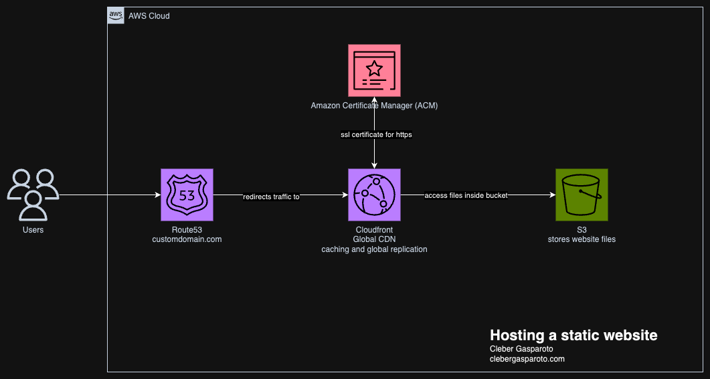

# 🌐 Static Website com Vite + Terraform + AWS S3/CloudFront

Este projeto demonstra como criar e publicar um **site estático moderno** usando [Vite](https://vitejs.dev/) (React + TypeScript) e provisionar toda a infraestrutura AWS (S3, CloudFront, Route 53, ACM) com Terraform.

---

## 📊 Diagrama da Solução



---

## 📁 Estrutura do Projeto

```
.
├── website/      # Código-fonte do site (React + Vite)
├── terraform/    # Infraestrutura como código (Terraform)
└── diagrama.png  # Diagrama da arquitetura do projeto
```

---

## 🚀 Como funciona

### 1. Frontend com Vite

- Projeto criado com:

  ```sh
  npm create vite@latest
  ```

  - Escolha: React + TypeScript + SWC

- Instale as dependências:

  ```sh
  cd website
  npm install
  ```

- Para desenvolvimento local:

  ```sh
  npm run dev
  ```

- Para gerar os arquivos de produção:

  ```sh
  npm run build
  ```

  Os arquivos finais ficam em `website/dist`.

- Para testar o build localmente:
  ```sh
  npm run preview
  ```

---

### 2. Infraestrutura com Terraform

Acesse a pasta `terraform` para provisionar a infraestrutura AWS:

- **Inicialize o backend remoto:**

  ```sh
  terraform init -backend=true -backend-config="backend.hcl"
  ```

- **Planeje a infraestrutura:**

  ```sh
  terraform plan -var domain_name="edemirtoldo.com.br"
  ```

- **Aplique (crie) a infraestrutura:**

  ```sh
  terraform apply -var domain_name="edemirtoldo.com.br" -auto-approve
  ```

- **Destrua a infraestrutura:**
  ```sh
  terraform destroy -var domain_name="edemirtoldo.com.br" -auto-approve
  ```

---

## 🏗️ O que o Terraform faz

- Cria um bucket S3 para hospedar o site estático.
- Faz upload automático dos arquivos de `website/dist` para o bucket.
- Cria um bucket de logs para auditoria.
- Provisiona um certificado SSL (ACM) para o domínio.
- Cria uma distribuição CloudFront para CDN e HTTPS.
- Cria registros DNS no Route 53 para apontar o domínio para o CloudFront.
- Aplica políticas de segurança para acesso via CloudFront.

> **Importante:**  
> O domínio `edemirtoldo.com.br` já deve estar configurado como Hosted Zone pública no Route 53 da sua conta AWS.

---

## 📝 Variáveis importantes

Veja [`variables.tf`](terraform/variables.tf):

- `aws_region`: Região AWS (padrão: `us-east-1`)
- `domain_name`: Domínio raiz do site (ex: `edemirtoldo.com.br`)

---

## 💡 Observações

- O deploy é totalmente automatizado: basta rodar o build do Vite e aplicar o Terraform.
- O bucket S3 e CloudFront são protegidos para acesso seguro e rápido.
- O domínio e SSL são gerenciados automaticamente.
- O backend remoto do Terraform usa S3 e DynamoDB para colaboração e segurança do estado.

---

## 📚 Referências

- [Vite](https://vitejs.dev/)
- [Terraform AWS S3 Static Website](https://registry.terraform.io/providers/hashicorp/aws/latest/docs/resources/s3_bucket)
- [Terraform AWS CloudFront](https://registry.terraform.io/providers/hashicorp/aws/latest/docs/resources/cloudfront_distribution)
- [Terraform Route 53](https://registry.terraform.io/providers/hashicorp/aws/latest/docs/resources/route53_record)
- [Documentação oficial do Terraform](https://developer.hashicorp.com/terraform/docs)
