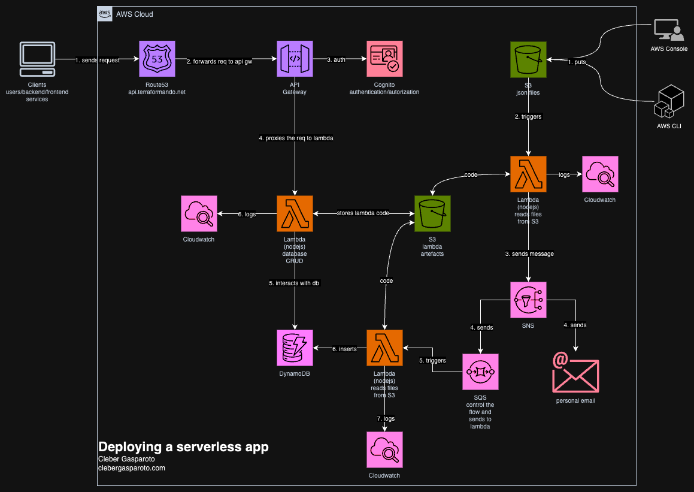

# 🖥️ Serverless App com Terraform e AWS

Este projeto demonstra como provisionar uma aplicação **serverless** completa na AWS usando Terraform, incluindo autenticação, API REST, mensageria, persistência e monitoramento.

---

## 📊 Diagrama da Solução



---

## 📁 Estrutura do Projeto

```
.
├── lambda/           # Código-fonte das funções Lambda (Node.js)
├── terraform/        # Infraestrutura como código (Terraform)
│   ├── main.tf
│   ├── iam.tf
│   ├── cognito.tf
│   ├── api_gateway.tf
│   ├── dynamodb.tf
│   ├── s3.tf
│   ├── sns_sqs.tf
│   ├── outputs.tf
│   ├── variables.tf
│   └── ...
└── README.md
```

---

## 🚀 Fluxo de Deploy

### 1. **Prepare o ambiente Lambda**

- Instale as dependências Node.js:
  ```sh
  cd lambda
  npm install
  ```
- O build das Lambdas será executado automaticamente pelo Terraform via `terraform_data.build`.

### 2. **Provisionamento da Infraestrutura**

Acesse a pasta `terraform` e execute:

```sh
terraform init -backend=true -backend-config="backend.hcl"
terraform plan -var domain_name="edemirtoldo.com.br"
terraform apply -var domain_name="edemirtoldo.com.br" -auto-approve
```

> **Nota:**  
> O domínio `edemirtoldo.com.br` deve existir como Hosted Zone pública no Route 53.

### 3. **Destruir a infraestrutura**

```sh
terraform destroy -var domain_name="edemirtoldo.com.br" -auto-approve
```

---

## 🏗️ O que é criado

- **Cognito:** User Pool, Client e domínio para autenticação.
- **API Gateway REST:** Endpoints, métodos, integrações, CORS e domínio customizado (opcional).
- **Lambdas:** Funções para lógica de negócio, triggers S3, SQS, SNS.
- **DynamoDB:** Tabela para persistência.
- **S3:** Buckets para uploads e artefatos das Lambdas.
- **SNS/SQS:** Mensageria e filas para processamento assíncrono.
- **IAM:** Perfis e permissões customizadas para cada serviço.
- **CloudWatch Logs:** Monitoramento de API Gateway e Lambdas.
- **Route 53 & ACM:** Domínio customizado e certificado SSL (se `domain_name` informado).

---

## 📝 Variáveis importantes

Veja [`variables.tf`](terraform/variables.tf):

- `aws_region`: Região AWS (padrão: `us-east-1`)
- `domain_name`: Domínio raiz da API (ex: `edemirtoldo.com.br`)
- `environment`: Ambiente (ex: `dev`, `prod`)
- `service_name`: Nome do serviço
- `service_domain`: Subdomínio para Cognito

---

## 💡 Observações

- O deploy é automatizado: basta rodar o build das Lambdas e aplicar o Terraform.
- O backend remoto do Terraform usa S3 e DynamoDB para colaboração e segurança do estado.
- O domínio Cognito deve ser único na região.
- O domínio do Route 53 deve existir antes do apply.
- O output da API Gateway usa o recurso `aws_api_gateway_stage` para evitar warnings de depreciação.

---

## 📚 Referências

- [Terraform AWS Provider](https://registry.terraform.io/providers/hashicorp/aws/latest/docs)
- [Serverless na AWS](https://aws.amazon.com/serverless/)
- [Terraform Test Framework](https://developer.hashicorp.com/terraform/language/tests)
