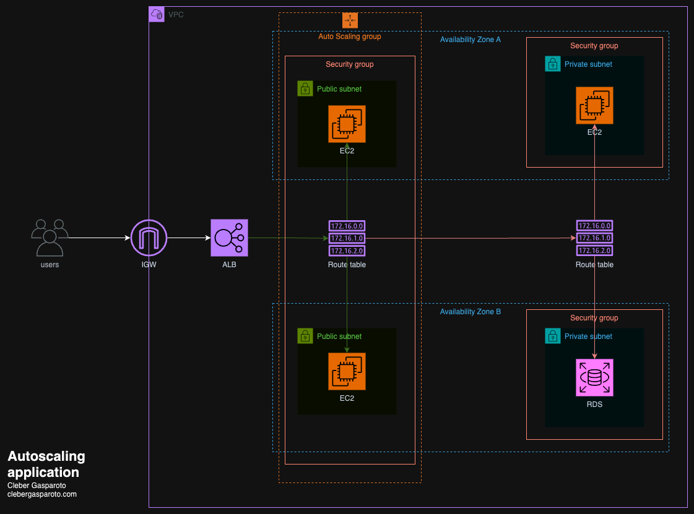

# 🚀 Projeto Auto Scaling App – Terraform + AWS

Este projeto demonstra como provisionar uma infraestrutura **escalável e automatizada** na AWS usando Terraform, incluindo VPC, Auto Scaling Group, Application Load Balancer (ALB), RDS, Security Groups e instância Jenkins para CI/CD.

---

## 📊 Diagrama da Solução



---

## 📁 Estrutura dos Arquivos

```
.
├── alb.tf                # Application Load Balancer e Target Group
├── backend.hcl           # Configuração do backend remoto do Terraform (S3/DynamoDB)
├── ec2.tf                # Launch Template, Auto Scaling Group, Jenkins e políticas de escalabilidade
├── locals.tf             # Locais para nomes, subnets e variáveis auxiliares
├── main.tf               # Provider AWS e tags padrão
├── nodejs_setup.sh       # Script de setup para instâncias Node.js
├── outputs.tf            # Outputs úteis da infraestrutura
├── rds.tf                # Banco de dados RDS MySQL
├── security_groups.tf    # Security Groups para ALB, ASG, RDS e Jenkins
├── variables.tf          # Variáveis parametrizáveis do projeto
├── versions.tf           # Versão do Terraform e providers
├── vpc.tf                # VPC, Subnets, Route Tables e Internet Gateway
├── scripts/request.js    # Script para simular carga no ALB
└── diagram.png           # Diagrama da arquitetura
```

---

## ⚙️ Comandos Utilizados

```sh
terraform init -backend=true -backend-config="backend.hcl"
export AWS_PROFILE=tf_thinkpad_edemirtoldo
terraform validate
terraform plan
terraform apply -auto-approve
terraform destroy -auto-approve
```

---

## 🏗️ O que é criado

- **VPC** com subnets públicas e privadas, Internet Gateway e Route Tables.
- **Security Groups** para controlar acesso ao ALB, instâncias do Auto Scaling, RDS e Jenkins.
- **Application Load Balancer (ALB)** para distribuir o tráfego HTTP.
- **Auto Scaling Group** com políticas baseadas em CPU e requisições no ALB.
- **Launch Template** para instâncias EC2 rodando Node.js (com script de setup automatizado).
- **RDS MySQL** em subnets privadas, acessível apenas pelo Auto Scaling Group.
- **Instância Jenkins** em subnet privada para CI/CD.
- **Outputs** com IDs e DNS dos principais recursos.

---

## 💡 Observações Importantes

- **AMI padrão:** O projeto usa uma AMI ARM64 (`t4g.micro`). Altere para uma AMI x86 se necessário.
- **Chave SSH:** O nome da chave SSH padrão é `"terraform"`. Altere em `variables.tf` se necessário.
- **Backend remoto:** O estado do Terraform é salvo em S3 e bloqueado via DynamoDB, conforme `backend.hcl`.
- **Permissões:** O perfil AWS `tf_thinkpad_edemirtoldo` deve ter permissões para criar todos os recursos.
- **Jenkins:** A instância Jenkins é criada para facilitar pipelines de CI/CD.
- **Carga de teste:** Use o script `scripts/request.js` para simular requisições ao ALB.

---

## 📚 Referências

- [Terraform AWS Provider](https://registry.terraform.io/providers/hashicorp/aws/latest/docs)
- [Documentação oficial do Terraform](https://developer.hashicorp.com/terraform/docs)
- [Auto Scaling na AWS](https://docs.aws.amazon.com/autoscaling/ec2/userguide/what-is-amazon-ec2-auto-scaling.html)
- [Application Load Balancer](https://docs.aws.amazon.com/elasticloadbalancing/latest/application/introduction.html)
